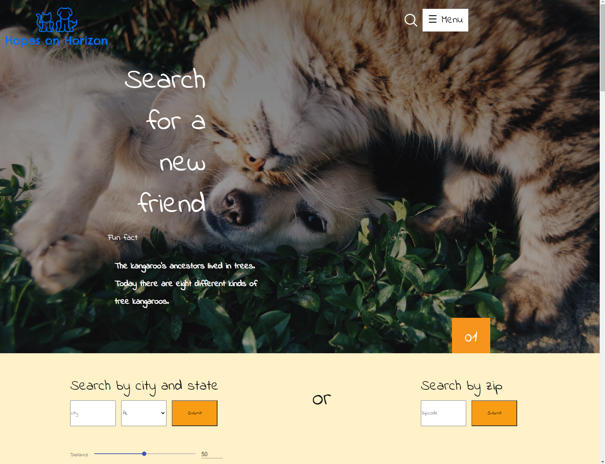
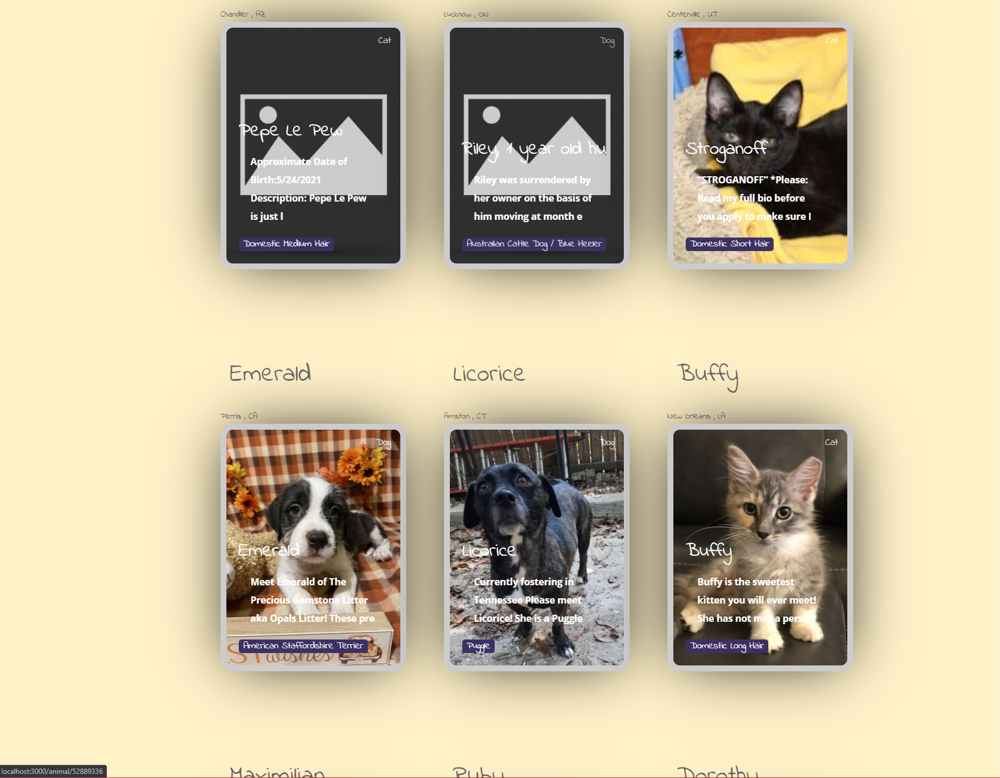
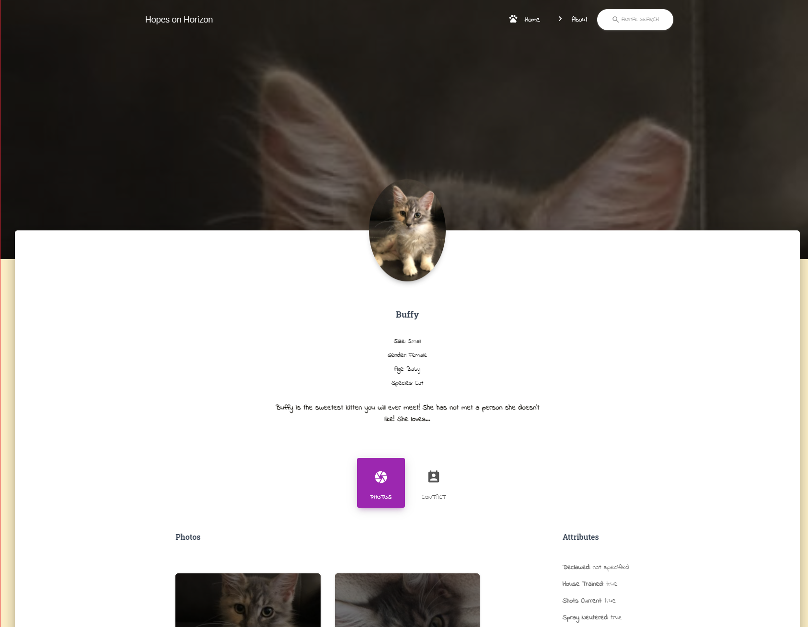

Must use a process env for access the client ID and Secret for the API requests. This should be created in the root of the srver folder.
test

This is an online animal shelter extending the petfinder api.

